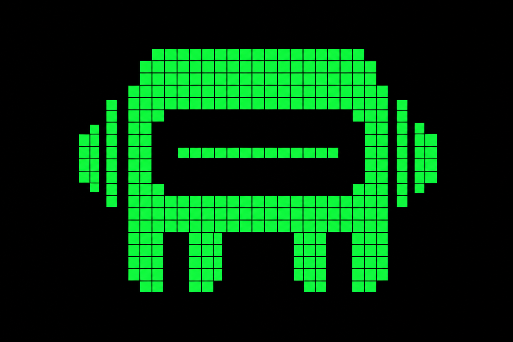
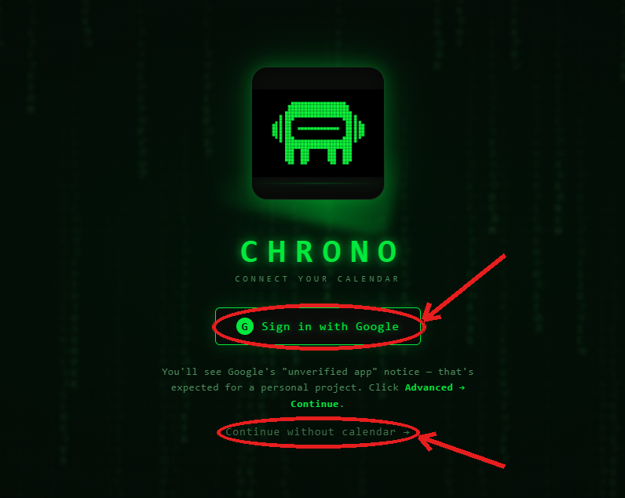
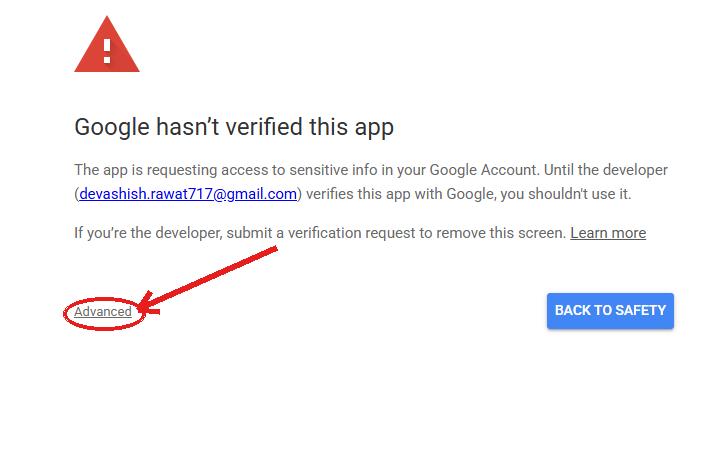
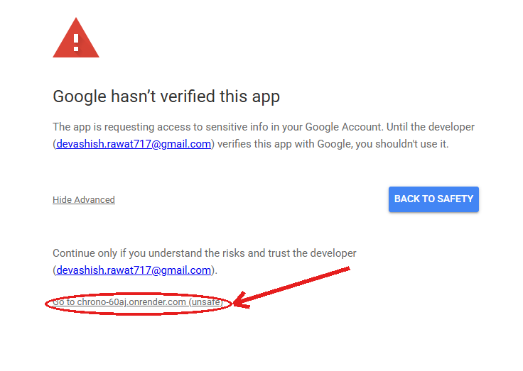
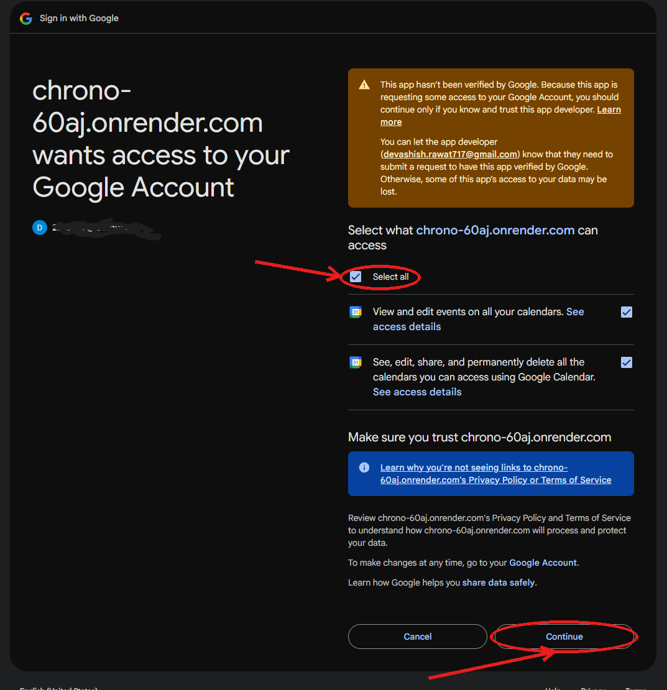

<div align="center">



# CHRONO

**An autonomous, multi-agent weekly planning assistant with a Matrix-themed terminal UI.**

Answer a few questions — Chrono classifies your tasks, builds a conflict-free weekly schedule with pure-Python precision, and hands you three outputs: **Google Calendar events**, a **styled Excel planner**, and a **plain-English summary** of your week.

[**▶ Live Demo**](https://chrono-60aj.onrender.com/) &nbsp;·&nbsp; [Structure](#-project-structure) &nbsp;·&nbsp; [How to use](#-how-to-use) &nbsp;·&nbsp; [Run locally](#-run-it-yourself)

</div>

---

## ✨ What it does

Chrono turns a short conversation into a fully-planned week. You tell it when you wake and sleep, your fixed commitments, how long you can focus, and what you want to get done. It does the rest — and it never double-books, never skips your breaks, and never overflows the day.

The guiding principle: **the LLM judges, but Python schedules.** Language models are great at understanding "is this deep-focus or routine work?" and terrible at the exact arithmetic of fitting blocks around meals without collisions. So Chrono splits the job — the LLM classifies and writes prose; a deterministic engine does every minute of placement.

---

## Architecture & workflow

```
 Onboarding ──▶ Task Analysis ──▶ Optimization ──▶  Three Outputs
  (parse &        (Groq LLM:        (deterministic     ├─ 📅 Google Calendar
   validate)     classify load/      Python placer)    ├─ 📊 Excel planner
                  urgency)                              └─ 📝 NL explanation
```

| Stage | Module | What happens |
|-------|--------|--------------|
| **1. Onboarding** | `onboarding.py` | Parses casual inputs (`7 am - 11 pm`, meals, commitments, tasks), validates them, flags anything unreadable. |
| **2. Task Analysis** | `task_analysis_agent.py` | Groq classifies each task as **deep** or **light** focus and assigns **urgency**. A keyword heuristic backs it up so obvious tasks are never re-asked. |
| **3. Optimization** | `optimization_agent.py` + `deterministic_scheduler.py` | Pure-Python placement: deep work biased to mornings, sessions split at your focus span, real breaks between blocks, meals & commitments kept sacred. Reports honestly if a day can't fit. |
| **Output 1** | `google_calendar.py` | Writes the schedule to your Google Calendar. |
| **Output 2** | `sheets_planner.py` | Generates a styled `.xlsx` weekly planner. |
| **Output 3** | `explanation_agent.py` | Groq (→ OpenRouter → deterministic fallback) writes a warm summary of your week. |

**Why deterministic scheduling?** LLMs double-book, ignore breaks, and burn tokens retrying arithmetic they can't do reliably. Placement is a constraint-satisfaction problem — Python solves it exactly, instantly, and with zero API calls. The LLM is reserved for the judgment calls it's actually good at.

**Two modes, one codebase.** The frontend auto-detects its backend, so the same `web/` runs as a desktop app (Eel) or a hosted web app (FastAPI) with no changes.

---

## 🗂️ Project structure

```
chrono_app/
├── app.py                    # Desktop entry point (Eel)
├── web_server.py             # Web entry point (FastAPI) — the hosted demo
├── web_google_auth.py        # Web OAuth redirect flow (PKCE)
├── main.py                   # CLI entry point (optional)
│
├── agents/                   # The pipeline — the "thinking"
│   ├── onboarding.py               # parse inputs, meals, validation
│   ├── task_analysis_agent.py      # classify cognitive load / urgency (LLM)
│   ├── optimization_agent.py       # orchestrates scheduling + meals + breaks
│   ├── deterministic_scheduler.py  # pure-Python placement engine
│   └── explanation_agent.py        # natural-language week summary
│
├── tools/                    # Integrations + LLM clients — the "doing"
│   ├── google_calendar.py          # Google Calendar read/write
│   ├── sheets_planner.py           # Excel planner (openpyxl)
│   ├── groq_client.py              # Groq API (raw requests)
│   ├── llm_backend.py              # LLM router / indirection layer
│   └── openrouter_client.py        # OpenRouter fallback (prose only)
│
├── web/                      # Frontend — served by both Eel and FastAPI
│   ├── index.html
│   ├── app.js                      # dual-mode: Eel local / HTTP hosted
│   ├── style.css
│   └── assets/                     # audio clips, logo, icons
│
├── config/                   # You create this — never committed
│   └── .env                        # GROQ_API_KEY, OPENROUTER_API_KEY, GOOGLE_* vars
│
├── requirements.txt
├── Procfile                  # Start command for Render/Railway
└── DEPLOY.md                 # Deployment + Google Cloud setup
```

> **Imports across folders:** `app.py` and `web_server.py` add `agents/` and `tools/` to `sys.path` at startup, so modules import by plain name (`from llm_backend import call_llm`). No `__init__.py`, no relative imports.

---

## How to use

Open the live demo and click through the boot screen. You'll reach a sign-in screen with two paths.

### Option A — With Google Calendar

Connect your Google account so Chrono can publish the finished schedule straight to your calendar.

**1. Click "Sign in with Google."**



**2. Because the app is unverified, Google shows a warning. Click "Advanced."**



**3. Then click "Go to chrono-60aj.onrender.com (unsafe)."**



**4. Review the permissions, tick "Select all," and click "Continue."**



> **Is this safe?** The "unverified app" notice is standard for personal projects that haven't paid for Google's formal verification. Chrono only **adds the schedule it generates** — you can revoke its access anytime at [myaccount.google.com/permissions](https://myaccount.google.com/permissions).

Once connected, answer the onboarding questions and Chrono builds your week, writes it to your calendar, and offers the Excel planner.

### Option B — Without Google Calendar

Not ready to connect an account? Click **"Continue without calendar →"** on the sign-in screen. You get the **full experience** — onboarding, scheduling, the on-screen weekly plan, the natural-language summary, and the **downloadable Excel planner**. Only the live calendar write is skipped.

### Answering the questions

Casual formats are accepted, and you can **press Enter to skip** any question:

```
What time do you wake up and sleep?   →  7 am - 11 pm        (or 7:00 AM - 11:00 PM)
Meal times (one per line)             →  Breakfast 8-9 am
Fixed weekly commitments              →  Gym: Mon/Wed/Fri 4-5 pm
Focus span before a break             →  2
Tasks to schedule                     →  DSA Practice (2 hrs/day)
                                          Build Chrono (10 hrs/week)
```

---

## 🖥️ Run it yourself

```bash
git clone https://github.com/Devashish-Rawat1/chrono.git
cd chrono
pip install -r requirements.txt
```

Create `config/.env` with your keys (calendar is optional — everything else works without it):

```env
GROQ_API_KEY=your_groq_key
OPENROUTER_API_KEY=your_openrouter_key      # optional (explanation fallback)
```

**Desktop app** (opens a local window):

```bash
python app.py
```

**Web server** (hosted-style, in a browser):

```bash
uvicorn web_server:app --reload --port 8000     # → http://localhost:8000
```

Full hosting and Google Cloud setup is in [`DEPLOY.md`](DEPLOY.md).

---

## Tech stack

| Area | Tools |
|------|-------|
| **Backend** | Python, FastAPI (web), Eel (desktop) |
| **LLM** | Groq `llama-3.3-70b-versatile` (primary), OpenRouter (prose fallback) |
| **Scheduling** | Custom deterministic constraint solver (pure Python) |
| **Integrations** | Google Calendar API (OAuth 2.0 + PKCE), openpyxl (Excel) |
| **Frontend** | Vanilla JS, CSS — Matrix rain, ASCII face, terminal UI, voice clips |
| **Deploy** | Render (free tier) + GitHub Actions keep-alive cron |

---

## Future plans

- ** Spotify integration** — focus/deep-work playlists that start with your scheduled sessions.
- ** Video analysis** — point Chrono at lecture or tutorial videos and have it schedule study blocks around them.
- ** Summarization** — condense notes, articles, or transcripts into tasks and time estimates automatically.
- ** Native desktop build** — a packaged `.exe` via PyInstaller for one-click install.
- ** Adaptive replanning** — reshuffle the week automatically when you miss or move a block.

---

## Origin

The idea was born from two obsessions: the **green-on-black cascade of _The Matrix_** and the feeling of having a capable assistant like **Iron Man's JARVIS** quietly organizing your world. Chrono is a small tribute to both — a planner that looks like it belongs in a terminal on the Nebuchadnezzar and thinks like an assistant that actually has your back.

---

<div align="center">

Built by **Devashish Rawat** &nbsp;·&nbsp; credit badge **"Drazan"**

[GitHub](https://github.com/Devashish-Rawat1) &nbsp;·&nbsp; [LinkedIn](https://www.linkedin.com/in/devashish-rawat01)

</div>
